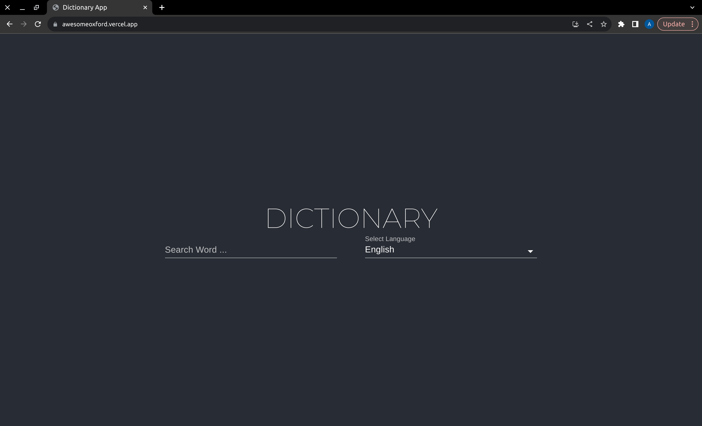

# Dictionary app in React.js:
A simple dictionary app using React.js and Material UI.
The Website is Live on [awesomeoxford.vercel.app](https://awesomeoxford.vercel.app/). Do give it a try!

## 📦 Tech Stack:

- [Material UI](https://material-ui.com/)  - Ready to use Material Design components.
- [Typescript](https://www.typescriptlang.org/)  - JavaScript with syntax for types.
- [Vite](https://vitejs.dev/)  - Next Generation Frontend Tooling.
- [React Js](https://reactjs.org/)  - A JavaScript library for building user interfaces.

  ## Screenshot:
  <a href="https://awesomeoxford.vercel.app/">
  <center>
    
  </center>
  </a>
  
## Features:

- [x] Uses [Material UI](https://material-ui.com/).
- [x] Search Words.
- [x] Listen to Words.

## Getting Started:

- Clone and install dependencies:

```bash
mkdir ~/Dev/dictionary -p
cd ~/Dev/dictionary
git clone https://github.com/Arvind-4/dictionary.git .
npm install
```

- Run development server:

```bash
npm run dev
```

Open [localhost:5173](http://localhost:5173/) in your Preferred Browser.
